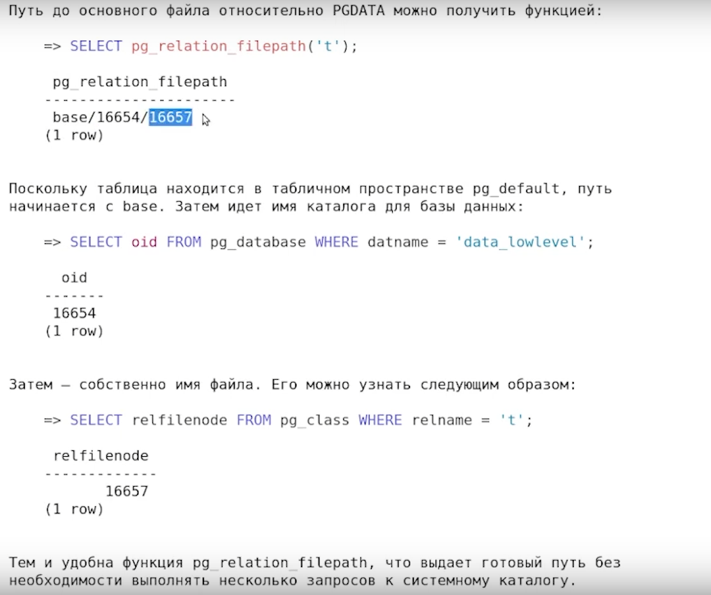

[Классификация СУБД](https://ru.wikipedia.org/wiki/%D0%A1%D0%B8%D1%81%D1%82%D0%B5%D0%BC%D0%B0_%D1%83%D0%BF%D1%80%D0%B0%D0%B2%D0%BB%D0%B5%D0%BD%D0%B8%D1%8F_%D0%B1%D0%B0%D0%B7%D0%B0%D0%BC%D0%B8_%D0%B4%D0%B0%D0%BD%D0%BD%D1%8B%D1%85#%D0%9A%D0%BB%D0%B0%D1%81%D1%81%D0%B8%D1%84%D0%B8%D0%BA%D0%B0%D1%86%D0%B8%D1%8F_%D0%A1%D0%A3%D0%91%D0%94)

шпаргалка по основным командам в интерактивном режиме


[https://www.oslogic.ru/knowledge/598/shpargalka-po-osnovnym-komandam-postgresql/](https://www.oslogic.ru/knowledge/598/shpargalka-po-osnovnym-komandam-postgresql/)

для просмотра содержимого файла /etc/passwd, вы можете использовать следующую команду:

```sh
cat /etc/passwd
```

```sql
CREATE or replace FUNCTION maximum(
a anycompatible,
b anycompatible,
c anycompatible DEFAULT NULL
) RETURNS anycompatible
AS $$
	SELECT CASE
		WHEN c IS NULL THEN		
			CASE WHEN a > b THEN a ELSE b END
			ELSE CASE WHEN c > b AND c > a THEN c 
				ELSE CASE WHEN b > c and b > a THEN b ELSE a END
			END
		END
	END
$$ LANGUAGE sql;


```


# Таблица умножения с помощью 


```sql
CREATE FUNCTION mul_table(max_line integer)
RETURNS TABLE(x integer, y integer, z integer)
IMMUTABLE LANGUAGE sql
BEGIN ATOMIC
    SELECT x, y, x * y as z
    FROM generate_series(1, max_line) AS x, 
         generate_series(1, max_line ) AS y;
END;

select * from mul_table(3);

```
# Регулярка

[https://postgrespro.ru/docs/postgresql/14/functions-matching](https://postgrespro.ru/docs/postgresql/14/functions-matching)

[https://habr.com/ru/articles/747934/](https://habr.com/ru/articles/747934/)


# dev1_02_arch_general.pdf

```sql
PREPARE q AS SELECT * FROM t;
```

Вы можете удалить одно подготовленное утверждение в текущем сеансе:

DEALLOCATE PREPARE <name>;
И вы можете удалить все подготовленные операторы в текущем сеансе:

DEALLOCATE PREPARE ALL;


# dev4

[https://habr.com/ru/companies/slurm/articles/684826/](https://habr.com/ru/companies/slurm/articles/684826/)

SQL — весьма сложная тема для погружения и понимания. Условно у нас есть 30 команд — и сотни способов и подходов, как их использовать. Мысля множествами, можем выбирать разные интерпретации SQL-языка, чтобы помочь базе данных выполнить наш запрос. Поэтому какой-то серебряной пули, то есть универсального способа ускорения SQL-запросов нет. Ну либо я не нашел этот философский камень). Нельзя сформировать пошаговую инструкцию, потому что для каждой базы, ситуации и запроса будет своя схема — нужно в общем понимать и чувствовать, что следует сделать.

Но чтобы сформировать это понимание, нужно на практике увидеть, как изменение отдельных параметров приводит к ускорению в конкретных ситуациях. Это мы и рассмотрим на практике.

Оптимизировать работу с данными можно четырьмя способами:

«Правильно» настроив конфигурацию БД, в нашем случае PostgreSQL.

Оптимизировав конкретные запросы.

Переработав архитектуру данных.

Изменив работу приложения.

Архитектуру данных и работу приложения мы затрагивать не будем, так как это напрямую не связано с SQL. А вот о конфигурации БД и оптимизации конкретных запросов поговорим на практических примерах.

журналирование 

[https://habr.com/ru/companies/postgrespro/articles/459250/](https://habr.com/ru/companies/postgrespro/articles/459250/)

```sql
SELECT pg_current_wal_lsn(), pg_current_wal_insert_lsn();
```
 
 ## Тип pg_lsn


[https://postgrespro.ru/docs/postgresql/15/datatype-pg-lsn](https://postgrespro.ru/docs/postgresql/15/datatype-pg-lsn)




[Контур-подключение](https://eshift.ktalk.ru/agmmxppkhcsi)

[https://postgrespro.ru/education/courses/DEV1](https://postgrespro.ru/education/courses/DEV1)

[Слайды + текст ](dev1_00_introduction.pdf)

[Создание базы данных (тест)](https://postgrespro.ru/docs/postgresql/16/tutorial-createdb)

[Подключение к базе данных (тест)](https://postgrespro.ru/docs/postgresql/16/tutorial-accessdb)