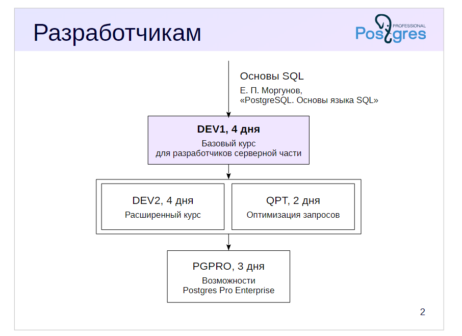

## Введение 

В ближайшие 4 дня планируем пройти учебный курс, учебный курс курс строится на 16 версии сервера  

который относится курс этот курс у нас уже был опыт 

посмотреть на линейку курсов по администрированию по разработке приложений чтобы для разработчиков предлагаем 3 вот и в качестве предварительных данных ожидаем что у разработчиков уже есть знания языка и sql соответствующего курса 

или у нас нет но есть много самых разных возможностей для того чтобы изучить

есть это работает другими базами данных которые поддерживают мы можем рекомендовать учебный курс Е.П. Моргунова

как называется основы языка и написанные специально для адресов при поддержке нашей компании и этот учебник можно купить как бумажном виде так на нашем сайте можно свободно скачать pdf-версию
 
и также нас на сайте есть и видеокурс с которые не почитал 17 squid у нас имеется три курса один наших ближайших четырех дней базу после разработки и 

после него можно в альбом порядке проходить еще два курса два расширенный курс и наш новый курс

основной упор на dev2 будет сделан на возможностях postgres встроенных в него, который позволяет его расширить достаточно сильно

и материал корпуса позволяет это что делает адрес максимально стать эффективным

а здесь его возможности раскрываются в полной мере и какие они именно рассматриваются в этом курсе

и кроме этого курс QPT предназначенный для оптимизации выполнения запросов - там подробно рассматриваться

* как после планируются выполнять запросы
* какие есть настройки влияющих на выполнение запросов
* как слабый местах запросах и что можно сделать для них оптимизации

помимо курсов для разработчиков  у нас еще есть линейка кусок для администраторов состоит из четырех курсов

вводный базовый курс 1

и помимо его после его прохождения можно уже в любом порядке проходить курсы DBA2, где делается упор на то как настраивать сервер как смотреть насколько эффективно функционирует процесс настройки

работают подправляю какие-то настройки для того чтобы сделать эту работу более эффективной курс дб-3

он предназначен для подробно посмотреть на задачи связанные с резервной копии deeply кации и курс кпт это тот же самый опыт и который мы предлагаем разработчик 

дело в том что во многих командах по разному распределяются вот ролик то ответственный за чтобы оптимизировать запрос где-то считается что теперь знает как это делать это разработчики этим должны заниматься но по хорошему знать это должны и те и другие разработчики с первую очередь потому что именно после их трудов выходят как свет появляются те запросы которые должны либо эффективно работать 

либо если они работают неэффективно тоже заводчики домик чего и оптимизируют но и администратор тем не менее тоже должен какие-то запросы работают не очень и курительных поэтому этот вас есть и там и там дополнительно 

еще могу сказать что для линейки курса связанных с администрированием мы сделали программу сертификации и у каждого из этих курсов можно сдать соответствующий тест аналогичная программа сертификации для разработчиков появится немножко пасть и теперь более подробно afro вкус deaf один который мы сейчас продолжительность у него четыре дня мы ожидали что вы уже знаете что такое работать видели какой-то язык программирования что-то на видео желательно и а не имеете представления как работать операционной системе unix 

потому что мы будем заниматься выполнять те практические задания по курсу именно выходя из операционной системы поэтому такие знания будут желать что на выходе после четырёх дней можно будет помощь прогеру сведения об архитектуре адрес это может быть показаться немножечко странно много начнем у седана с общим устройство всех они сразу же сами разработку программировали 

 потому что для того чтобы эффективно заниматься разработкой нужно принимать какие есть принципе инструменты и механизмы на себе как он устроен это будет даваться не очень много команд в том объеме который необходим мы посмотрим как работает базовые объекты а на стороне сервера таблиц или иные цели представлениями вот и достаточно подробно рассмотрим создание функций и процедур на стороне сервера это можно делать на разных языках 
 
 мы подробно будем говорить о том как это делать на языках sql и жеский а некоторые более сложные вещи типа как работать с массивами как работает с типами данных составного типа посмотрим ну и вообще как организовать взаимодействие между клиентом и сервером в качестве материалов которые поставляются вместе с курс я вас идет у нас подготовлены виртуальная машина с операционной системой 
 
 собственные необходимы навыки работает близость там в этой операционный в грунте что уже предустановлена документация о 12 воздуху на русском языке эскиз ты вдруг по каким-то причинам нет соединения с планет или не можете пойти документацию открыть на сайте то она уже предустановлена и в браузере закладку по умолчанию является документация
 
 а кроме этого virtual уже предустановлена учебная веб-приложение книжные магазины
 
 мы по ходу всего курса будем помимо разнообразных дополнительных практических заданий 
 
 основная часть практики будет посвящено там что вы от темы теме будем строить вот это веб-приложение 
 
 его мы не будем ни клиентскую часть мы будем дела серы клиентская чисто на ужин отнесенные предустановку 
 
 кстати одна из причин почему нужно использовать именно наш евротур вашей плане просто поставить адрес который на свой компьютер потому что вот то есть вещи как поставить на сложнее чем взять уже готов в течение всего курса мы будем использовать консольный клиент для работы с плотные сам пытки говорить о некотором многочисленным просьбам именно со стороны разработчиков мы предоставили для плотвы и графические струне наш выбор пал по разным причинам наглядным 4
 
вон там поле предустановлен но не будем на нем концентрировать как его использовать как с ним работать просто если кому-то друг действительно это уровне то вы можете воспользоваться во всех темах и демонстрации будем все показывать 
  
  именно достали учебные материалы начинать всегда есть смысл с руководство слушателя особенно для тех кто проходит курс нет учебном центре а мише самостоятельно а позаниматься 
  
  правда начинает ветви нас руководство слушатели там написано как раз откуда скачать виртуалку как получить материал курсы и да ты вообще информации о том как борьба этого значит материалов у нас имеются а презентации которые показывать слайды и и комментарии с вами по достаточно подробные там же будут демонстрации практические задания и решения эти вот все материалы они у нас было доступны в двух форматах 
  
  по макушке или формат и 1050 формат это его основная задача если вы захотите распечатать их на бумаге но вот как раз есть смысл и дед форматных печать а если вы хотите просто открыть и смотреть пример копировать какие-то куски кода снова в редактор формата школу для этого проиалов ну например для тех кто не очень хорошо знаком плотность это сделать лучше они пока не очень хорошо ли какие-то нести куда обслуживающих у нас есть специальные файле вот в котором группировка именно по типам данных например сенатор их число логические и примеры разных функций которые с этими типами данных умеет работать можно конечно же и все та же самую информацию на этих документации но здесь достаточно компактным на нескольких страничках а можно быстро посмотреть среде есть схема данных системного каталога работать в основном и с чем у нас призывает если вы с ним не очень хорошо знакомого хотели бы это сделать получше то вот в этой диаграмме там можно увидеть основные таблиц системного каталога не те команды которые позволяют получить информацию и коровки справочник по некоторым командам unix потому что или наших демонстрации мы неизбежно будут какие-то команды выполнять если же не все таки не так хорошо знаете и никто может быть быстрым справочку мы будем заниматься еще четыре я примерно это будет составлять 8 академических часов вот и плюс 48 химических примерно 6 странами будет примерно где-то посредине а почему примерно потому что темы курса они как правило не занимают ровно 45 минут какие-то темы чуть больше какие-то чуть дольше и поэтому время мы немножечко черт он еще может быть как раз и по причине того что вы будете задавать активно вопросы а мы будем должны на эти вопросы отвечать если вдруг вот я и мои коллеги вот будем знать ответ сразу а не скажем в этом упаковка она конечно же вы же мог сразу рассказывать это может удлинять процесс мы всегда люблю когда нам задают вопросы поэтому не стесняйтесь их можно задавать любое время чем больше вопросов тем лучше вот и после карпе темы мы будем устраивать отдельные перерывы ну кроме перерыва на ней мы будем отдавать практические задания вот в первый день это будет у нас в доме по 20 минут начиная с завтрашнего дня у нас практика будет занимать минут по 30 и с расчетом на то что можно эту практику сделать еще там концертов несколько минут начнется следующий первый день сегодняшние у нас будет посвящен в основном обзор архитектуры после со принципе для тех кто например по каким-то причинам уже был знаком с курсом кбайт в можно все эти темы по кажутся знакомыми здесь можно сказать то что принципе действительно материал частично пересекается но он сделан именно с упором на разработчиков то есть не показывается дополнительная информация которую важно например администратором на разработчикам у нее может быть знать и не сильно обязательно начиная с завтрашнего дня мы начнем заниматься разработкой приложений от нижний нагрев клиентская часть которая уже готова а мы начнем заниматься в сердце поэтому все практики по всем темам начиная со второго не они будут делиться на 2 1 будет практика практика это будет практик который относится к книжному магазину и и делать обязательно нужно в обязательном порядке потому что эти практики выстроены таким образом что каждая следующая она учитывает результаты предыдущих но условно говоря если мы водой тени создаем в таблице следующих темах начинаем строить функции которые каким-то образом взаимодействуют с этими таблицами то не создав таблицы с эти функции большого смысла не поэтому эти практики нужно в обязательном порядке а те практики которые дополнительные идут каждый день но их вы можете его просто посмотреть там задание прицениться и если действительно попробовать сделать и либо можно с этим позаниматься потомках вечером другие рекомендуем всегда сначала попробовать самим сделать задача потом опять же даже если вы его сделали хорошо и правильно посмотрите где решения которые предлагаем и иногда мы в этих решениях давайте решение выносим какой-то материал которого не было в основной теме а он у нас оказался именно под в практике такое иногда бывает поэтому решение которые мы предлагаем вот так значится здорово дне мы начнем уже заниматься разработкой приложения подобно посмотрим на то как создаются функции и процедуры зайдет одной из важных отличий этого курса предыдущей версии ос и по версии 12 курса по версии 96 это тоже начиная с 1 ст версии плоть из и появилась эти процедуры там появилась ровно для того чтобы хранимых программе была возможность управлять транзакции полнеть мидера какие то что функция списке возможных процедур такая возможность появилась и завтра же начнем второй день язык и ps2 которые продукции третий день 4 же день и а замыкает коз еще 2 темы они такого достаточно обзорного характера вопрос связанный с разграничением доступа то есть можно организовать разным ролям осмоса доступ к тем или иным объект базы данных и последние темы опять же это новое тело в 12 повседневного 6 посчитали что общие сведения о том как выполняется логическое резервирование росписи разработчикам тоже полезно знать но для простоты очевидных по годам и даже на самом деле не только победа использовать команду коды для вставки данных по которым тоже полезно никакой информации вот так построен наш это была такая модная тема предисловия

