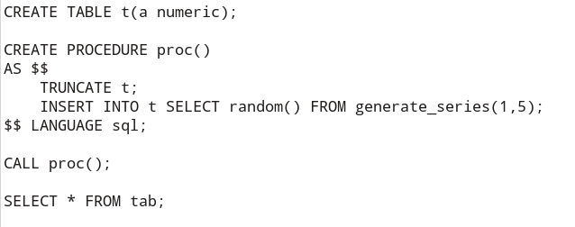
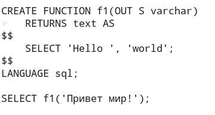
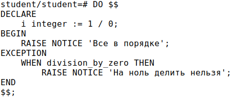
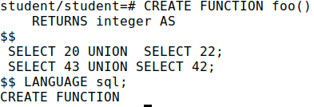
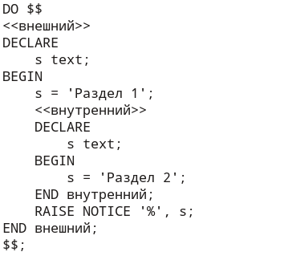

## 1. Можно ли обратиться к функции, возвращающую скалярное значение как к таблице?

Выберите один ответ:

* Да, с помощью ключевого слова EXECUTE

* Нет, это невозможно

* Да, с использованием ключевого слова CALL

* Да, это возможно если обратиться к функции в предложении FROM

* Нет, только таблицы можно запрашивать через SELECT

## 2. Каким образом можно ограничить полученные данные с помощью SQL запроса?

* Выберите один ответ:
* SELECT DISTINCT
* FILTER BY
* WHERE
* (x) LIMIT

## 3.Какие значения будут выводиться при выполнении последнего оператора SELECT * FROM tab?

Выберите один ответ:

* (x) После выполнения скрипта в таблице tab будет храниться пять случайных чисел.
* После выполнения скрипта таблица tab не будет содержать никаких данных.
* При выполнении скрипта будет показано сообщение об ошибке.
* Результат выполнения зависит от настроек безопасности.

## 4. Какие шаги необходимо предпринять для создания триггеров для обработки команды MERGE?

Выберите один ответ:
* (x) Создать триггеры для вставки, обновления и удаления данных
* Использовать выражение CASE для обработки команды MERGE внутри триггера
* Использовать механизм транзакций для согласованности данных при выполнении MERGE
* Разработать хранимую процедуру для реализации функциональности MERGE

Вопрос 5 из 30

## 5. Ознакомьтесь с текстом. Какой будет вывод функции?

Выберите один ответ:

* Ошибка создания функции - нужно указать язык plpgsql
* 'world'
* 'Hello world'
* 'Привет мир!'
* (x) Ошибка создания функции несовпадение типов выходного параметра и функции

## 6. Какой из следующих уровней изоляции не поддерживается в PostgreSQL?

Выберите один ответ:

* READ COMMITTED
* REPEATABLE READ
* SERIALIZABLE
* (x) READ UNCOMMITTED

## 7. Какую характеристику курсорной переменной в PL/pgSQL нужно учитывать при их объявлении и использовании?

Выберите один ответ:

* Имя курсора должно быть уникальным
* (x) Курсоры не могут использоваться внутри транзакций
* Каждому курсору обязательно нужно задать тип данных
* По умолчанию курсоры открываются в режиме автокоммит
* Курсоры не могут быть объявлены внутри циклов.

## 8. Какую команду необходимо использовать для создания нового пользователя?

Выберите один ответ:

* CREATE ROLE
* INSERT USER
* (x) REGISTER USER
* ADD USER
* NEW USER

## 9. Что произойдет при выполнении данного блока кода?

Выберите один ответ:

* Будет выведено сообщение "На ноль делить нельзя"
* (x) Произойдет ошибка синтаксиса
* Программа завершится с исключением division by zero
* Будет выведено сообщение "Все в порядке"

## 10. В каких ситуациях целесообразно применять оператор EXECUTE?

Выберите один ответ:

* При необходимости выполнения динамических SQL запросов
* Для создания новых таблиц
* Для определения типов данных в хранимых процедурах
* Для управления пользователями и правами доступа к базе данных
* При выполнении транзакций с использованием сохраненных процедур.

## 11 Какие опции утилиты pg_dump позволяют выбирать объекты для восстановления из выходного файла? Выберите несколько вариантов.

Выберите несколько ответов:

* -t, --table=TABLENAME
* -F, --format=format
* -T, --exclude-table=TABLENAME
* -n, --schema=SCHEMANAME
* -a, --data-only

## 12. Что делает следующий код в PL/pgSQL? FOREACH i IN ARRAY a42 LOOP RAISE LOG '%', i; END LOOP;

Выберите один ответ:

* Устанавливает одинаковое значение i для каждого элемента массива a42.
* Выводит каждый элемент массива a42 в журнале сообщений сервера.
* Получает сумму всех элементов массива a42 и записывает ее в переменную i.
* Итерирует по элементам массива a42, увеличивая каждый из них на единицу.

## 13. Какие характеристики роли pg_database_owner следует учитывать?

Выберите один ответ:

* В нее можно включить внешнюю учетную запись
* Она не может управлять объектами и получать права доступа
* В нее можно включить другие роли явно
* Нельзя добавить роль pg_database_owner явно в другую роль

## 14. Какой уровень изоляции гарантирует, что каждый последующий запрос в транзакции будет видеть данные, согласованные на момент начала транзакции?

Выберите один ответ:

* Read Uncommitted
* Read Committed
* Serializable
* Repeatable Read

## 15. Какое отличие между функцией и процедурой?

Выберите один ответ:

* Функция может возвращать значение, процедура не может
* Процедура может выполнять DML операции напрямую, функция не может
* Функция должна всегда возвращать значение, процедура может не возвращать
* Процедура может вызывать другие процедуры, функция не может
* Функции легче использовать в SQL запросах, чем процедуры.

## 16. Какое значение вернет функция?

Выберите один ответ:

* 20
* 22
* 43
* 42
* Обращение к функции завершится с ошибкой

## 17. Какой способ можно использовать для удаления базы данных с отключением всех клиентов?

Выберите один ответ:

* DROP DATABASE D1 WITH (FORCE);
* DROP DATABASE IF EXISTS D1;
* ALTER DATABASE D1 SET SINGLE_USER WITH ROLLBACK IMMEDIATE; DROP DATABASE D1;
* Использовать команду KILL для отключения клиентов, а затем удалить базу данных;
* Переименовать базу данных, создать новую и скопировать данные.

## 18. Какой тип триггера в PostgreSQL используется для обработки событий после выполнения операции, но до фиксации транзакции?

Выберите один ответ:

* AFTER INSTEAD OF
* INSTEAD OF ROW
* BEFORE UPDATE
* (x) AFTER STATEMENT
* INSTEAD OF DELETE

## 19. Что происходит в PL/pgSQL, когда встречается ошибка в блоке кода без секции обработки исключений?

Выберите один ответ:

* Блок кода автоматически повторяется до успешного выполнения.
* Ошибка игнорируется и выполнение кода продолжается.
* PostgreSQL создает секцию исключения по умолчанию.
* PostgreSQL пытается автоматически исправить ошибку.
* Ошибка вызывает прерывание выполнения блока кода и передачу ошибки вызывающему коду.

## 20. Как можно сделать составной типа данных?

Выберите один ответ:

* С помощью оператора CREATE TYPE.
* С использованием ключевого слова COMPOSITE
* С помощью ключевого слова STRUCT
* Используя ключевое слово ARRAY
* С использованием функции DEFINE_TYPE
* Используя ключевое слово UNION

## 21. В каких сценариях можно применить команду ROLLBACK для отмены транзакции?

Выберите один ответ:

* В функции
* В процедуре
* В функции и в процедуре
* В триггере
* В подпрограммах нельзя управлять транзакциями

## 22. Какие права доступа у псевдороли public к схеме public по умолчанию в 16-ой версии?

Выберите один ответ:

* SELECT, INSERT
* USAGE
* USAGE, DROP
* CREATE
* USAGE, CREATE

## 23. Какой параметр позволяет автоматически находить таблицу в нужной схеме при обращении к ней по короткому имени?

Выберите один ответ:

* searchschema
* autoschema
* searchpath
* schemapath

## 24. Какой тип триггера лучше всего использовать для автоматического заполнения поля при вставке строки через сложное представление?

Выберите один ответ:

* BEFORE STATEMENT
* BEFORE ROW
* INSTEAD OF ROW
* AFTER ROW
* AFTER TRIGGER

## 25. В какой секции PL/pgSQL обрабатываются исключения?

Выберите один ответ:

 * BEGIN
 * LOOP
 * EXECUTE
 * (x) EXCEPTION
 * CATCH

 
## 26. Какие из перечисленных операций являются частью механизма транзакций?

Выберите один ответ:

* Исполнение и переписывание запросов.
* Разбор и планирование запросов.
* Фиксация (COMMIT) и откат (ROLLBACK) изменений.
* Подключение и аутентификация клиентов.

## 27. Какие типы изменчивости функций используются в PL/pgSQL?

Выберите несколько ответов:

* STABLE
* IMMUTABLE
* CALLED ONCE
* VOLATILE
* LEAKPROOF
* CALM

## 28. В режиме изоляции READ COMMITED когда происходит построение снимка данных?

Выберите один ответ:

* Перед началом каждой транзакции
* Перед каждым запросом к таблице
* В момент начала каждой транзакции
* В момент начала чтения каждой строки данных
* (x) При выполнении каждого оператора транзакции

## 29. Каким образом можно заполнить одномерный массив в PL/pgSQL?

Выберите один ответ:

* С помощью оператора ARRAY
* Используя функцию CREATEARRAY()
* При помощи ключевого слова FILLARRAY()
* Через использование оператора INSERT INTO

## 30. Какая команда используется для перечитывания конфигурационных файлов без перезапуска сервера?

Выберите один ответ:

* RELOAD POSTGRESQL
* (x) SELECT pg_reload_conf();
* UPDATE pg_configuration SET reload = true;
* RESTART CONFIGURATION

## 31 Вам надо написать цикл FOR, который должен отработать 10 раз. Надо ли заранее объявлять в секции DECLARE переменную для счетчика цикла?

Выберите один ответ:

* да
* (x) нет
* в зависимости от формы цикла FOR
* есть специальная переменная цикла i

## 32. Какая строка будет выведена на экран после выполнения данного блока кода?

Выберите один ответ:

* (x) Раздел 1
* Раздел 2
* Пустая строка
* Ошибка выполнения кода
* Ничего не выведется

## 33. Какие данные получает триггерная функция на каждую строку до выполнения операции UPDATE?

Выберите один ответ:

* Старые данные (OLD)
* Новые данные (NEW)
* Данные транзакции (TRANSACTION)
* (x) Старые данные и новые данные (OLD, NEW)
* Данные изменений (CHANGES)

## 34. Опишите процедуру передачи курсора клиенту в PL/pgSQL. Какие шаги включены в этот процесс и каковы его потенциальные применения?

Выберите один ответ:

* Курсоры не могут быть переданы клиенту; они всегда используются исключительно внутри сервера для управления данными.
* (x) Курсор открывается в PL/pgSQL и передается клиенту только для чтения данных, без возможности выполнения операций записи или обновления.
* Клиент может выполнять операции чтения курсора, но не управление транзакциями.
* Функция на PL/pgSQL открывает курсор и возвращает его имя клиенту, который может управлять данными курсора, включая чтение и обновление