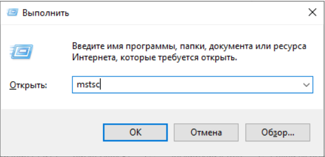
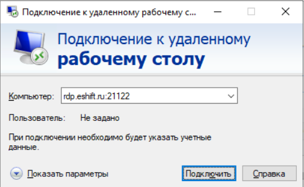

# Разработка серверной части приложений PostgreSQL. Базовый курс


Доступ к стендам для выполнения лабораторных работ осуществляется по протоколу RDP. 

Для начала запустите программу `«Подключение к удалённому рабочему столу»`

Один из способов это сделать – найти её в меню `«Пуск»`. 

Кроме того, можно открыть окно «Выполнить» с помощью комбинации клавиш `Win+R` и ввести команду `mstsc`, после чего нажать ОК 



## Стенды

| ФИО	 | Ссылка |	Логин |	Пароль|
| -------|--------|-------|-------| 
| Петренко Анна Алексеевна | rdp.eshift.ru:12166 |	administrator |	SWDGPa$$w0rd|
| Никитина Анна Алексеевна |rdp.eshift.ru:12167 |	administrator |	SWDGPa$$w0rd|
| Собянин Василий Михайлович |rdp.eshift.ru:12168 |	administrator |	SWDGPa$$w0rd|
| Потемкин Дмитрий Юрьевич |rdp.eshift.ru:12169 |	administrator |	SWDGPa$$w0rd|
| Серов Николай Евгеньевич |rdp.eshift.ru:12170 |	administrator |	SWDGPa$$w0rd|





В `Linux` рекомендуется использовать `FreeRDP` или аналогичный клиент. 

Если в вашей организации действует ограничение на использование протокола `RDP`, обратитесь к специалистам Учебного центра для предоставления доступа на веб-шлюз.

 

## Внутри стенда:

### Виртуальные машины:

> DEV1-student-16

> Учётные данные для доступа к виртуальным машинам:

`student` - `student`


### Установка PostgreSQL в Ubuntu (опционально)

> Сначала обновите списки пакетов:

```sh
sudo apt update
```


> Установите СУБД PostgreSQL

```sh
sudo apt -y install postgresql
```


> После установки СУБД откройте терминал и переключитесь на пользователя postgres с помощью команды:

```sh
sudo -i -u postgres
```


```sh
psql
```

```
\conninfo
```


```sql
sudo apt install curl
```


```sh
sudo apt install pgadmin4-desktop
```