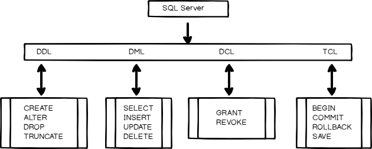

* DDL (Data Definition Language) – работа со структурой БД,

* DML (Data Manipulation Language) – работы с данными таблиц,

* DCL (Data Control Language) – работа с правами,

* TCL (Transaction Control Language) – работа с транзакциями.

