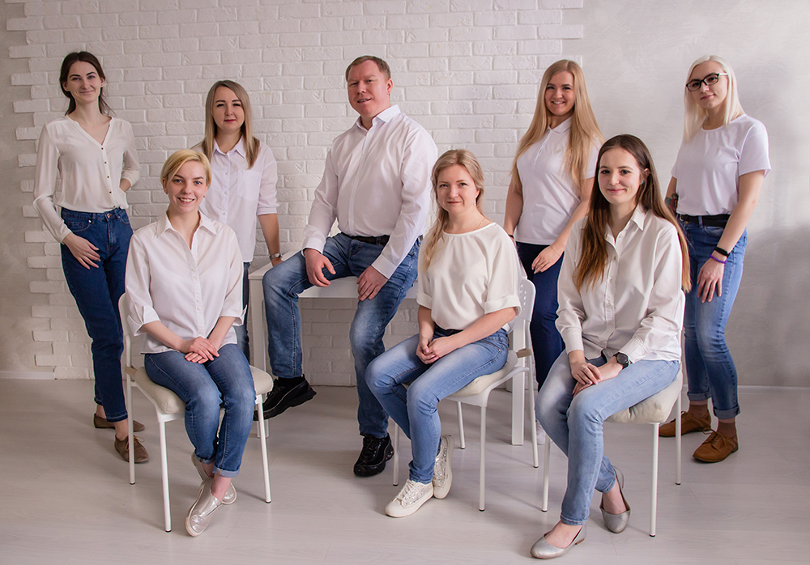

# Разработка серверной части приложений PostgreSQL 16.

Программа курса: «Разработка серверной части приложений PostgreSQL. Базовый курс» 
 
## Модуль 1. Введение.   

## Модуль 2. Базовый инструментарий:   
* установка и управление, psql.  

## Модуль 3. Архитектура:   
* общее устройство PostgreSQL;  
* изоляция и многоверсионность;  
* буферный кэш и журнал.  

## Модуль 4. Организация данных:   
* логическая структура;  
* физическая структура.  

## Модуль 5. Приложение «Книжный магазин»:   
* схема данных приложения;  
* взаимодействие клиента с СУБД.  

## Модуль 6. SQL:   
* функции;  
* составные типы.  
## Модуль 7. PL/pgSQL:  

* обзор и конструкции языка;  
* выполнение запросов;  
* курсоры;  
* динамические команды;  
* массивы;  
* обработка ошибок;  
* триггеры;  
* отладка.  

## Модуль 8. Разграничение доступа:   
* обзор.  

## Модуль 9. Резервное копирование:   
* логическое резервирование.  
 

# Учебный центр "Шифт"

Учебный центр «ШИФТ» специализируется на обучении IT специалистов, обучает мировым лидерам IT-отрасли, готовит специалистов высокого класса к реальной практической работе.

За это время было разработано более 100 специализированных курсов: для программистов, системных администраторов, системных аналитиков, разработчиков и т.д.

Кроме этого, Школа информационных и финансовых технологий подготавливает профессионалов по направлению автоматизированного проектирования, обучает офисный персонал организации, и проводит тренинги, начиная от малого бизнеса заканчивая корпорациями. 

Преподаватели учебного центра вкладывают все свои знания, умения и навыки с огромным практическим опытом в каждого слушателя.

Учебные классы полностью укомплектованы оборудованием для комфортного обучения, оснащены современной техникой и презентационным оборудованием.

[https://www.eshift.ru/o-nas/uchebnyy-tsentr-shift/](https://www.eshift.ru/o-nas/uchebnyy-tsentr-shift/)